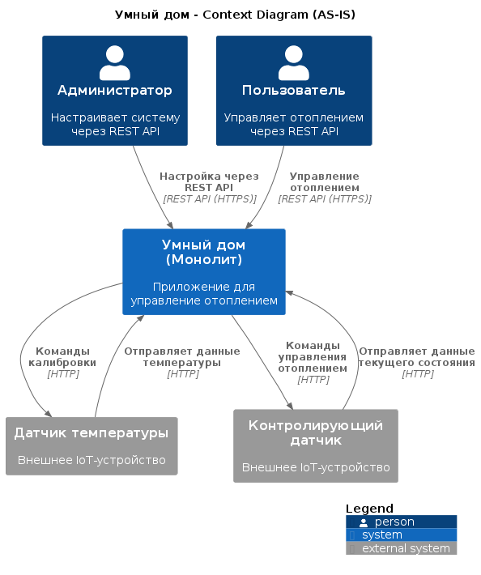
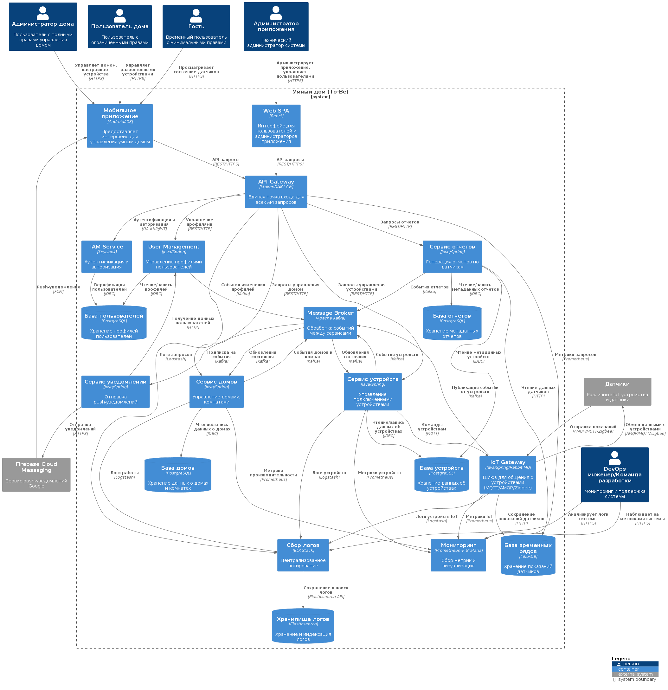
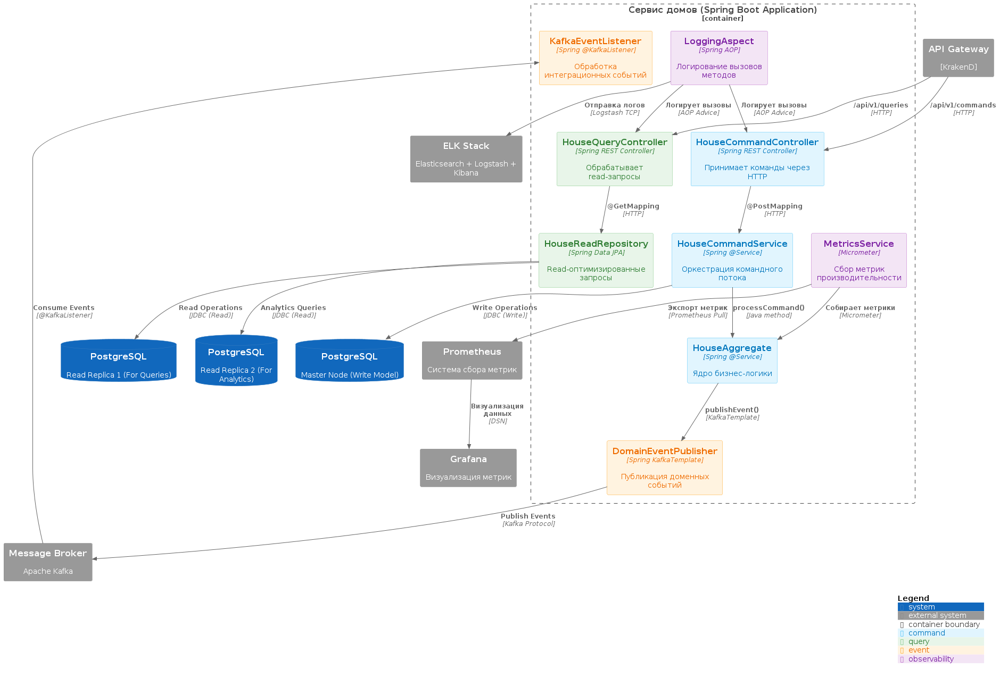
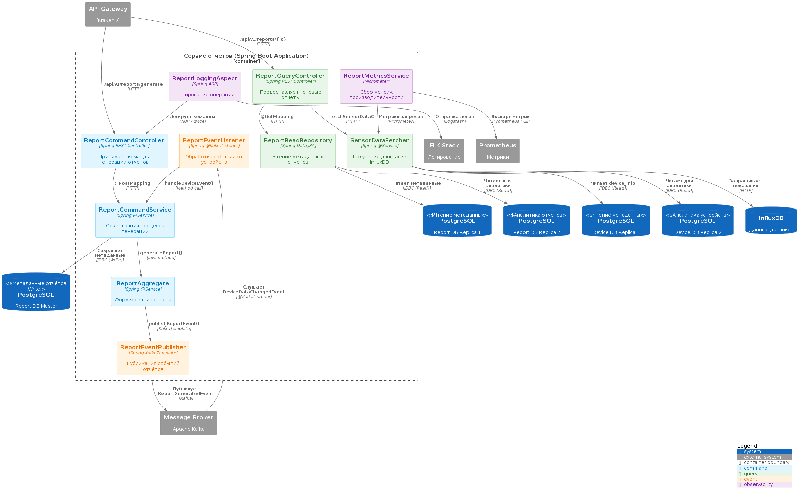
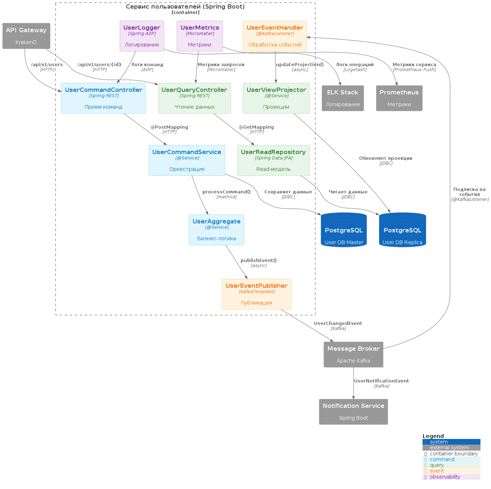
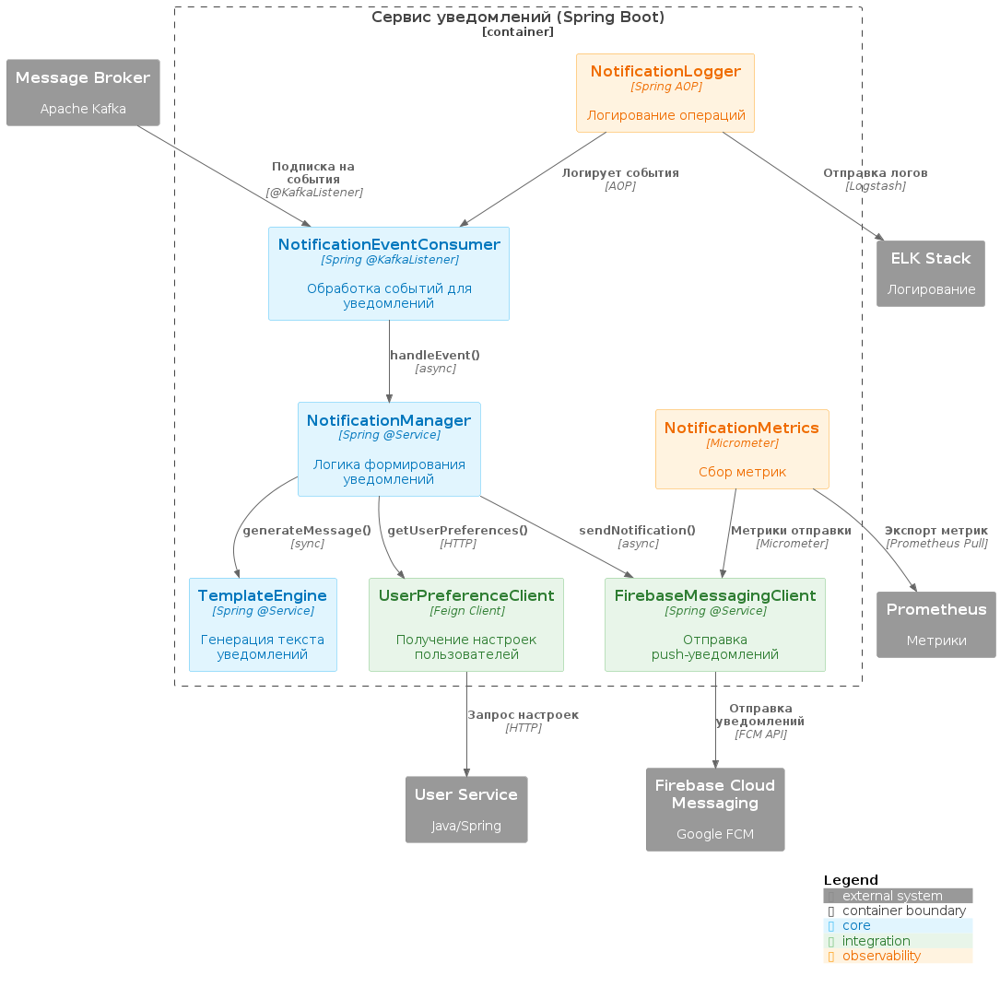
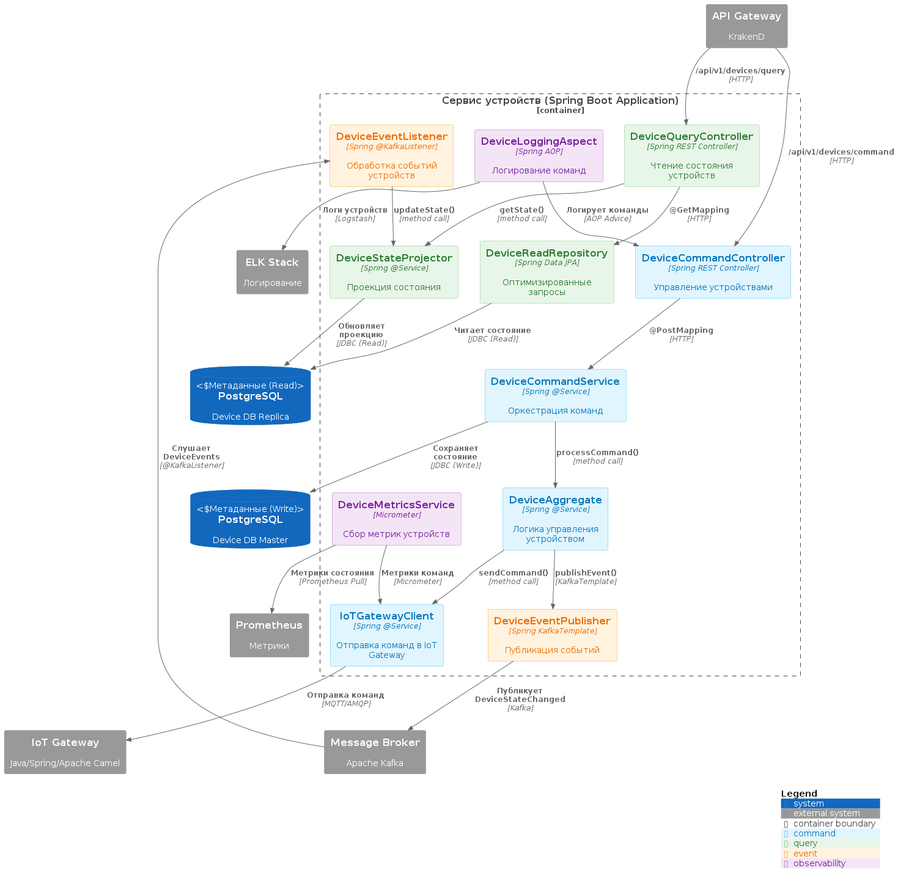
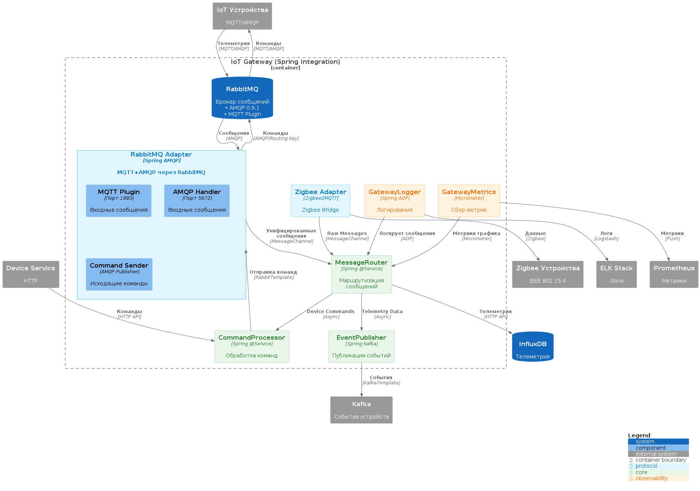
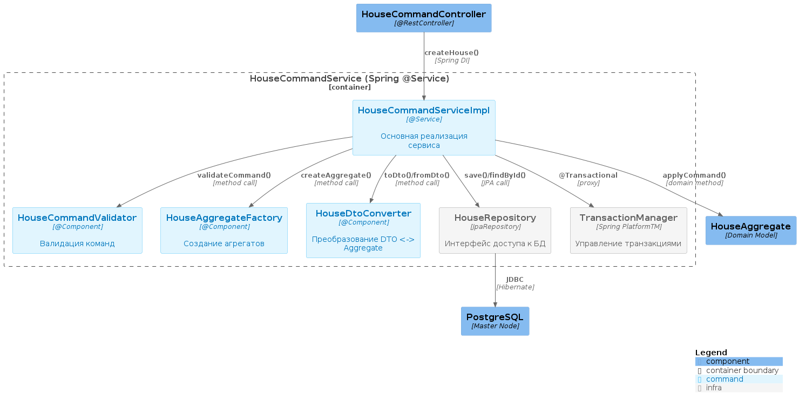
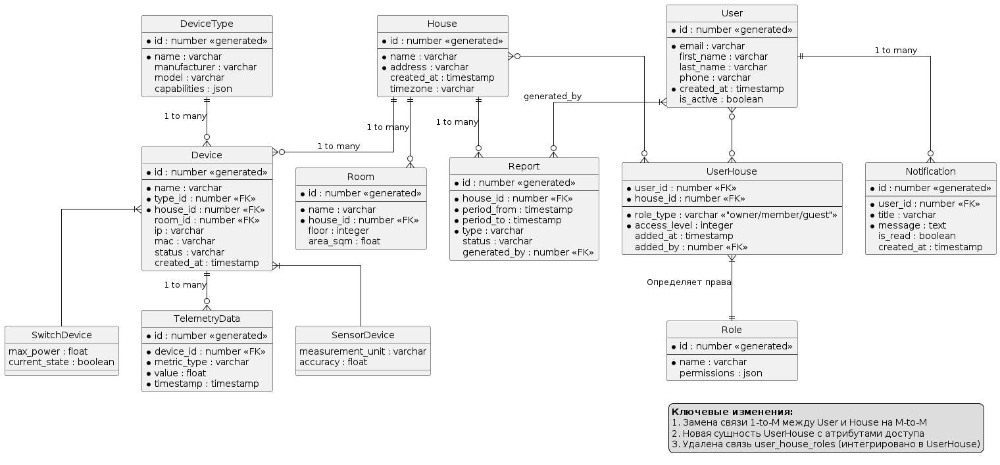

# Задание 1. Анализ и планирование

«Тёплый дом» — это небольшая компания, которая организует удалённое управление отоплением в доме. Недавно она выиграла тендер и получила заказ на создание экосистемы умных посёлков на территории нескольких регионов страны.

Состояние компании в настоящий момент не позволяет в полной мере реализовать новые бизнес-цели. Для этого требуется пересмотр и оптимизация всей экосистемы.

### 1. Описание функциональности монолитного приложения

**Управление отоплением**

Нынешнее приложение компании позволяет управлять отоплением в доме.

Посредством API система поддерживает следующую функциоанльность:

- Получить информацию о системе отопления
- Обновить параметры системы отопления
- Включить систему отопления
- Выключить систему отопления

**Мониторинг температуры**

Нынешнее приложение компании позволяет проверять температуру.

Посредством API система поддерживает следующую функциоанльность:

- Установить целевую температуру (с параметром temperature)
- Получить текущую температуру

### 2. Анализ архитектуры монолитного приложения

**Текущие особености реализации**

1. Язык программирования: Java
2. База данных: PostgreSQL
3. Для взаимодействия с БД используется ORM Hibernate
3. Архитектура: Монолитная, все компоненты системы (обработка запросов, бизнес-логика, работа с данными) находятся в рамках одного приложения.
4. Взаимодействие: Синхронное, запросы обрабатываются последовательно.
5. Масштабируемость: Ограничена, так как монолит сложно масштабировать по частям.
6. Развёртывание: Требует остановки всего приложения.

### 3. Определение доменов и границы контекстов

**1. Домен "Управление отоплением" (Heating Management)**

Контекст: Управление системой отопления (включение/выключение, установка температуры, мониторинг состояния).

Границы контекста: Этот домен отвечает за управление настройками отопления

**2.  Домен "Мониторинг температуры" (Temperature Monitoring)**

Контекст: Сбор и хранение данных о температуре.

Границы контекста: Пока что этот домен изолирован и не связан с HeatingSystem, хотя логически должен взаимодействовать (например, для автоматического регулирования температуры).

**3. Домен "Пользовательское API" (User API)**

Контекст: Предоставление интерфейса для управления системой.

Границы контекста: Отвечает только за внешнее API, не содержит бизнес-логики.

**Проблемы текущего разделения контекстов**

- Слабая связь между HeatingSystem и TemperatureSensor
В текущей реализации HeatingSystem хранит свою currentTemperature, но также есть отдельная сущность TemperatureSensor, которая тоже хранит температуру. Это может привести к несогласованности данных (например, если датчик обновляется, а система отопления не знает об этом).

- Отсутствие явного домена "Автоматическое регулирование"
В коде есть TODO про "автоматическое поддержание температуры", но сейчас эта логика отсутствует.


### **4. Проблемы текущего, монолитного решения**

**1. Слабая модульность и нарушение границ контекстов**

- HeatingSystem и TemperatureSensor логически относятся к разным доменам, но жестко связаны через общую БД.
- Нет четкого разделения между управлением отоплением и мониторингом температуры.

Вышеописанные проблемы могут привести к следующим последствиям:
- Изменения в одной сущности могут неожиданно повлиять на другую.
- Сложно масштабировать или заменять один компонент без изменений в другом.

**2. Проблемы с согласованностью данных**

- HeatingSystem хранит currentTemperature, но также есть TemperatureSensor, который тоже хранит температуру.
- Нет механизма синхронизации этих данных.

Вышеописанные проблемы могут привести к следующим последствиям:
- Риск расхождения данных (например, датчик обновился, а система отопления "не знает" об этом).


**3. Нет событийной модели**

- Изменения состояния (например, включение обогрева) не отправляются как события.
- Если позже нужно будет добавить уведомления (например, в Telegram) или логирование в Elasticsearch, придется изменять существующие сервисы.

Вышеописанные проблемы могут привести к следующим последствиям:
- Система негибкая, сложно добавлять новые функции без модификации ядра.


**4. Отсутствие аутентификации и авторизации**

- Любой пользователь может вызывать API без проверки прав.
- Нет разграничения доступа (например, только администратор может менять targetTemperature).

Вышеописанные проблемы могут привести к следующим последствиям:
- Уязвимость безопасности (например, злоумышленник может выключить отопление).

**5. Монолитная архитектура**

- Вся логика в одном приложении.
- Если система будет масштабироваться (например, добавится управление освещением, кондиционерами), код станет слишком сложным.

Вышеописанные проблемы могут привести к следующим последствиям:
- Сложность развертывания (нельзя обновлять компоненты по отдельности).
- Риск "распухания" монолита.

**6. Нет документации API**

- Нет Swagger/OpenAPI-спецификации.
- Клиенты (например, мобильное приложение) не знают, какие эндпоинты доступны.

Вышеописанные проблемы могут привести к следующим последствиям:
- Усложняется интеграция с фронтендом.

**7. Отсутствие явной бизнес-логики для автоматического регулирования**

- В коде есть TODO ("Implement automatic temperature maintenance logic"), но сейчас система не умеет автоматически поддерживать температуру.
- Логика "сравнить текущую температуру с целевой и включить/выключить нагрев" должна быть вынесена в отдельный сервис.

Вышеописанные проблемы могут привести к следующим последствиям:
- Пользователь вынужден вручную управлять системой, хотя это можно автоматизировать.


### 5. Визуализация контекста системы — диаграмма С4

Контекстная диаграмма текущей архитектуры приложения (AS IS).

```markdown
./c4-diagrams/context-of-current-monolith.puml
```



# Задание 2. Проектирование микросервисной архитектуры

**Диаграмма контейнеров (Containers)**

Контейнерная диаграмма планируемой архитектуры приложения (TO BE).

```markdown
./c4-diagrams/container-microservices.puml
```



**Диаграмма компонентов (Components)**

**1. Компонентная диаграмма для house-microservice**

```markdown
./c4-diagrams/component-diagrams/component-house-microservice.puml
```



**2. Компонентная диаграмма для report-microservice**

```markdown
./c4-diagrams/component-diagrams/component-report-microservice.puml
```



**3. Компонентная диаграмма для user-microservice**

```markdown
./c4-diagrams/component-diagrams/component-user-service.puml
```



**4. Компонентная диаграмма для notification-microservice**

```markdown
./c4-diagrams/component-diagrams/component-notification-microservice.puml
```



**5. Компонентная диаграмма для device-microservice**

```markdown
./c4-diagrams/component-diagrams/component-device-microservice.puml
```



**6. Компонентная диаграмма для iot-gateway**

```markdown
./c4-diagrams/component-diagrams/component-iot-gateway.puml
```



**Диаграмма кода (Code)**

**1. Диаграмма кода для HouseCommandService в house-microservice**

```markdown
./c4-diagrams/code-diagrams/house-microservice/code-HouseCommandService.puml
```



# Задание 3. Разработка ER-диаграммы

**ER Диаграмма**

```markdown
./er-diagrams//ER-diagram.puml
```




# ❌ Задание 4. Создание и документирование API
